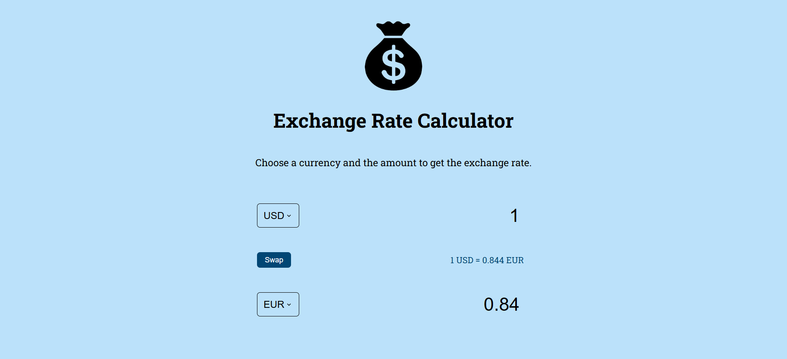

# Exchange Rate Calculator
A simple web-based currency exchange rate calculator that lets you select two currencies, enter an amount, and instantly see the converted value. The app fetches live exchange rates using the **ExchangeRate API**. 

The calculator displays two dropdowns for selecting the currencies, input fields for entering an amount in one currency and seeing the equivalent in the other, and a swap button to quickly reverse the conversion direction.

### Features
- Convert between 20+ currencies (USD, EUR, GBP, JPY, AUD, CAD, etc.).
- Live exchange rates fetched from ExchangeRate API (https://www.exchangerate-api.com/).
- Swap button to reverse the selected currencies.

### Technologies used
- **HTML5** - structure.
- **CSS** - styling.
- **JavaScript / jQuery** - fetching API data and uploading DOM.
- **ExchangeRate API** - currency conversion rates.

## Installation guide
1. Clone this repository: ``git clone https://github.com/dianabali/exchange-rate-api.git``
2. Open ``index.html`` in your browser.

## Images

